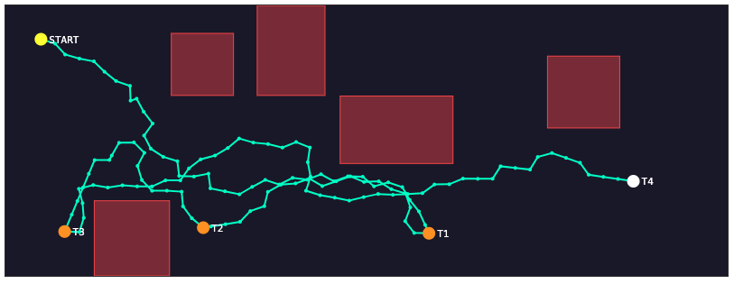

# Autonomous-Robot
RRT-like path planning for the final project of ENGR122 as TA

## Path finding
Key variables to tune:
- BUFFER: safety margin
- MAX_SAMPLES: maximum number of iterations for random sampling
  
Inside folder pathfinder
```console
	g++ pathfinder.c -o output
  ./output
```
Will output in the terminal PATH_X[], PATH_Y[], and PATH_LEN
Code will generate path_plot.html
<p float="left">
	
</p>

## Arduino programming
Copy values PATH_X[], PATH_Y[], and PATH_LEN in Arduino script to follow a collision-safe path
